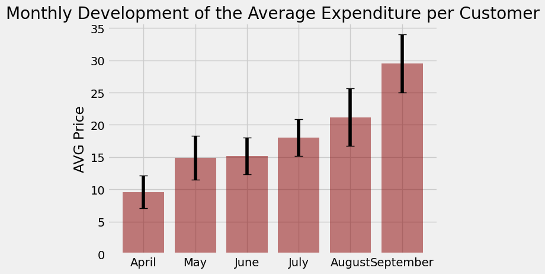

## Board Slides for FoodWheel
***


FoodWheel is a startup delivery service that takes away the struggle of deciding where to eat! FoodWheel picks you an amazing local restaurant and lets you order through the app. Senior leadership is getting ready for a big board meeting, and as the resident Data Analyst, you have been enlisted to help decipher data and create a presentation to answer several key questions:

What cuisines does FoodWheel offer? Which areas should the company search for more restaurants to partner with?
How has the average order amount changed over time? What does this say about the trajectory of the company?
How much has each customer on FoodWheel spent over the past six months? What can this tell us about the average FoodWheel customer?

Over this project, you will analyze several DataFrames and create several visualizations to help answer these questions.

## Project Requirements

1. Before we begin analyzing our data, we need to import two Python packages. To be able to load in and inspect our datasets, we must first import the pandas package. We will also need to create visualizations to help us analyze the data. This requires us to import pyplot, a subset of the Matplotlib package.


```python
import pandas as pd
import matplotlib.pyplot as plt

plt.style.use("fivethirtyeight")
```

## Cuisine Offerings

2. Now that we have imported the pandas package, we can begin looking at our data. Load and inspect the restaurant data from `restaurants.csv` into a DataFrame called `restaurants`.


```python
restaurant = pd.read_csv("restaurants.csv")
restaurant.head()
```


<div>
<style scoped>
    .dataframe tbody tr th:only-of-type {
        vertical-align: middle;
    }

    .dataframe tbody tr th {
        vertical-align: top;
    }

    .dataframe thead th {
        text-align: right;
    }
</style>
<table border="1" class="dataframe">
  <thead>
    <tr style="text-align: right;">
      <th></th>
      <th>id</th>
      <th>name</th>
      <th>neighborhood</th>
      <th>cuisine</th>
    </tr>
  </thead>
  <tbody>
    <tr>
      <th>0</th>
      <td>1</td>
      <td>Jongro BBQ</td>
      <td>Midtown</td>
      <td>Korean</td>
    </tr>
    <tr>
      <th>1</th>
      <td>2</td>
      <td>Pocha 32</td>
      <td>Midtown</td>
      <td>Korean</td>
    </tr>
    <tr>
      <th>2</th>
      <td>3</td>
      <td>Nom Wah Tea Parlor</td>
      <td>Chinatown</td>
      <td>Chinese</td>
    </tr>
    <tr>
      <th>3</th>
      <td>4</td>
      <td>Roberta’s</td>
      <td>Brooklyn</td>
      <td>Pizza</td>
    </tr>
    <tr>
      <th>4</th>
      <td>5</td>
      <td>Speedy Romeo</td>
      <td>Brooklyn</td>
      <td>Pizza</td>
    </tr>
  </tbody>
</table>
</div>


3. Now that we have our data loaded in and inspected, we can start to ask some questions about the data. Suppose we wanted to know how many different types of cuisine FoodWheel offers and how many different restaurants serve that type of cuisine. Print out your answers to both questions.


```python
restaurant.cuisine.nunique()
cuisine_counts = restaurant.groupby("cuisine").count().reset_index()
cuisine_counts
```


<div>
<style scoped>
    .dataframe tbody tr th:only-of-type {
        vertical-align: middle;
    }

    .dataframe tbody tr th {
        vertical-align: top;
    }

    .dataframe thead th {
        text-align: right;
    }
</style>
<table border="1" class="dataframe">
  <thead>
    <tr style="text-align: right;">
      <th></th>
      <th>cuisine</th>
      <th>id</th>
      <th>name</th>
      <th>neighborhood</th>
    </tr>
  </thead>
  <tbody>
    <tr>
      <th>0</th>
      <td>American</td>
      <td>10</td>
      <td>10</td>
      <td>10</td>
    </tr>
    <tr>
      <th>1</th>
      <td>Chinese</td>
      <td>11</td>
      <td>11</td>
      <td>11</td>
    </tr>
    <tr>
      <th>2</th>
      <td>Italian</td>
      <td>8</td>
      <td>8</td>
      <td>8</td>
    </tr>
    <tr>
      <th>3</th>
      <td>Japanese</td>
      <td>4</td>
      <td>4</td>
      <td>4</td>
    </tr>
    <tr>
      <th>4</th>
      <td>Korean</td>
      <td>3</td>
      <td>3</td>
      <td>3</td>
    </tr>
    <tr>
      <th>5</th>
      <td>Pizza</td>
      <td>4</td>
      <td>4</td>
      <td>4</td>
    </tr>
    <tr>
      <th>6</th>
      <td>Vegetarian</td>
      <td>4</td>
      <td>4</td>
      <td>4</td>
    </tr>
  </tbody>
</table>
</div>


4. The board wants to make sure that FoodWheel offers a wide variety of restaurants. Having many different options makes customers more likely to come back. Create a pie chart that shows the different types of cuisines available on FoodWheel.


```python
fig1, ax1 = plt.subplots()

ax1.pie(cuisine_counts.id, labels=cuisine_counts.cuisine, autopct="%1.1f%%", startangle=90)
ax1.axis("equal")
ax1.set_title("Available Cuisines at FoodWheel")

plt.show()
plt.close()
```


    

    


## Order Price Over Time

5. FoodWheel is a relatively new start-up.  They launched one year ago and have grown more popular since then.  Management suspects that the average amount spent on each order has increased over time. 

    First, load in the `orders.csv` dataset as `orders` and inspect it.


```python
orders = pd.read_csv("orders.csv")
orders.head()
```


<div>
<style scoped>
    .dataframe tbody tr th:only-of-type {
        vertical-align: middle;
    }

    .dataframe tbody tr th {
        vertical-align: top;
    }

    .dataframe thead th {
        text-align: right;
    }
</style>
<table border="1" class="dataframe">
  <thead>
    <tr style="text-align: right;">
      <th></th>
      <th>id</th>
      <th>customer_id</th>
      <th>date</th>
      <th>price</th>
    </tr>
  </thead>
  <tbody>
    <tr>
      <th>0</th>
      <td>1</td>
      <td>61</td>
      <td>6-18-2017</td>
      <td>13.0</td>
    </tr>
    <tr>
      <th>1</th>
      <td>2</td>
      <td>210</td>
      <td>5-8-2017</td>
      <td>21.0</td>
    </tr>
    <tr>
      <th>2</th>
      <td>3</td>
      <td>0</td>
      <td>9-7-2017</td>
      <td>33.0</td>
    </tr>
    <tr>
      <th>3</th>
      <td>4</td>
      <td>66</td>
      <td>7-7-2017</td>
      <td>19.0</td>
    </tr>
    <tr>
      <th>4</th>
      <td>5</td>
      <td>65</td>
      <td>4-26-2017</td>
      <td>13.0</td>
    </tr>
  </tbody>
</table>
</div>


6. Perhaps tracking the orders made per month can help us determine a trend. Group the `orders` data by month.


```python
orders["month"] = orders.date.str.split("-").str[0]

orders
```


<div>
<style scoped>
    .dataframe tbody tr th:only-of-type {
        vertical-align: middle;
    }

    .dataframe tbody tr th {
        vertical-align: top;
    }

    .dataframe thead th {
        text-align: right;
    }
</style>
<table border="1" class="dataframe">
  <thead>
    <tr style="text-align: right;">
      <th></th>
      <th>id</th>
      <th>customer_id</th>
      <th>date</th>
      <th>price</th>
      <th>month</th>
    </tr>
  </thead>
  <tbody>
    <tr>
      <th>0</th>
      <td>1</td>
      <td>61</td>
      <td>6-18-2017</td>
      <td>13.0</td>
      <td>6</td>
    </tr>
    <tr>
      <th>1</th>
      <td>2</td>
      <td>210</td>
      <td>5-8-2017</td>
      <td>21.0</td>
      <td>5</td>
    </tr>
    <tr>
      <th>2</th>
      <td>3</td>
      <td>0</td>
      <td>9-7-2017</td>
      <td>33.0</td>
      <td>9</td>
    </tr>
    <tr>
      <th>3</th>
      <td>4</td>
      <td>66</td>
      <td>7-7-2017</td>
      <td>19.0</td>
      <td>7</td>
    </tr>
    <tr>
      <th>4</th>
      <td>5</td>
      <td>65</td>
      <td>4-26-2017</td>
      <td>13.0</td>
      <td>4</td>
    </tr>
    <tr>
      <th>...</th>
      <td>...</td>
      <td>...</td>
      <td>...</td>
      <td>...</td>
      <td>...</td>
    </tr>
    <tr>
      <th>495</th>
      <td>496</td>
      <td>152</td>
      <td>9-29-2017</td>
      <td>22.0</td>
      <td>9</td>
    </tr>
    <tr>
      <th>496</th>
      <td>497</td>
      <td>82</td>
      <td>4-7-2017</td>
      <td>13.0</td>
      <td>4</td>
    </tr>
    <tr>
      <th>497</th>
      <td>498</td>
      <td>61</td>
      <td>9-28-2017</td>
      <td>25.0</td>
      <td>9</td>
    </tr>
    <tr>
      <th>498</th>
      <td>499</td>
      <td>98</td>
      <td>8-13-2017</td>
      <td>20.0</td>
      <td>8</td>
    </tr>
    <tr>
      <th>499</th>
      <td>500</td>
      <td>145</td>
      <td>5-19-2017</td>
      <td>19.0</td>
      <td>5</td>
    </tr>
  </tbody>
</table>
<p>500 rows × 5 columns</p>
</div>


7. While we are interested in the average order amount spent each month (average price), it wouldn't hurt to include the standard deviation as well. Calculate the average and standard deviation of the amount spent per month (`price`) and store each as its own separate variable.


```python
avg_order_by_month = orders.groupby("month").price.mean()
std_order_by_month = orders.groupby("month").price.std()

print(avg_order_by_month)
print(std_order_by_month)
```

    month
    4     9.609195
    5    14.858824
    6    15.152174
    7    18.012821
    8    21.150685
    9    29.505882
    Name: price, dtype: float64
    month
    4    2.562504
    5    3.395210
    6    2.835934
    7    2.848985
    8    4.455556
    9    4.518806
    Name: price, dtype: float64
    

8. At last, we can now visualize our data. Create a bar plot that demonstrates the trend in average order size over time. Make sure to include the following information:


```python
fig2, ax2 = plt.subplots()

month = ["April", "May", "June", "July", "August", "September"]
values = avg_order_by_month
errors = std_order_by_month

#barplot
ax2.bar(month, values, yerr=errors, align="center", color="darkred", alpha=0.5, ecolor="black", capsize=5)
ax2.set_title("Monthly Development of the Average Expenditure per Customer")
ax2.set_ylabel("AVG Price")

plt.show()
plt.close()
```


    

    


## Customer Orders

9. There is a range of amounts that customers spend at FoodWheel. Create a `customer_amount` DataFrame that stores each customer and how much they order.

    **Hint:**
    
    Start by grouping `orders` by `customer_id` and calculating the total amount spent by each customer.  Save your results to `customer_amount`.


```python
customer_amount = orders.groupby("customer_id").price.sum().reset_index()

customer_amount

print(customer_amount.max())
```

    customer_id    249.0
    price          145.0
    dtype: float64
    

10. Create a histogram of the amount spent by each customer over the past six months with the following format:

     -The range should be from 0 to 200
     
     -The number of bins should be 40
     
     -Label the x-axis `Total Spent`
     
     -Label the y-axis `Number of Customers`
     
     -Add a title


```python
fig3, ax3 = plt.subplots()

#create hist
ax3.hist(customer_amount.price, bins=40, range=(0,150))

ax3.set_title("Amount Spent by Customers")
ax3.set_xlabel("Total Spent")
ax3.set_ylabel("Number of Customers")


plt.show()
plt.close()
```


    

    


### Extra Challenge

After a great round of applause, a member of the senior leadership board would quickly like to see the neighborhoods that have the most restaurants. 

Create a visualization to display the restaurant count for each neighborhood.

**Hint:**

View the unique neighborhoods.

Calculate the value counts of the neighborhood variable.

Create a list of the neighborhood count values.


```python
restaurant.neighborhood.nunique()

neighborhood = restaurant.neighborhood.value_counts().reset_index()

#rename columns
neighborhood = neighborhood.rename(columns={"index": "Neighborhoods", "neighborhood": "Counts"})

#add percentage
neighborhood["percentages"] = (neighborhood.Counts/neighborhood.Counts.sum())*100

neighborhood
```


<div>
<style scoped>
    .dataframe tbody tr th:only-of-type {
        vertical-align: middle;
    }

    .dataframe tbody tr th {
        vertical-align: top;
    }

    .dataframe thead th {
        text-align: right;
    }
</style>
<table border="1" class="dataframe">
  <thead>
    <tr style="text-align: right;">
      <th></th>
      <th>Neighborhoods</th>
      <th>Counts</th>
      <th>percentages</th>
    </tr>
  </thead>
  <tbody>
    <tr>
      <th>0</th>
      <td>Downtown</td>
      <td>14</td>
      <td>31.818182</td>
    </tr>
    <tr>
      <th>1</th>
      <td>Brooklyn</td>
      <td>10</td>
      <td>22.727273</td>
    </tr>
    <tr>
      <th>2</th>
      <td>Midtown</td>
      <td>8</td>
      <td>18.181818</td>
    </tr>
    <tr>
      <th>3</th>
      <td>Chinatown</td>
      <td>7</td>
      <td>15.909091</td>
    </tr>
    <tr>
      <th>4</th>
      <td>Uptown</td>
      <td>3</td>
      <td>6.818182</td>
    </tr>
    <tr>
      <th>5</th>
      <td>Queens</td>
      <td>1</td>
      <td>2.272727</td>
    </tr>
    <tr>
      <th>6</th>
      <td>UWS</td>
      <td>1</td>
      <td>2.272727</td>
    </tr>
  </tbody>
</table>
</div>


```python
fig4, ax4 = plt.subplots()

ax4.bar(neighborhood.Neighborhoods, neighborhood.Counts)
ax4.set_title("Restaurants per Neighborhood")
plt.xticks(rotation=45)

#add text
percentages = neighborhood.percentages
for i,v in enumerate(percentages):
    ax4.text(i, neighborhood.Counts[i]+0.2, f'{v:.1f}%', ha="center")

plt.show()
plt.close()
```


    

    

